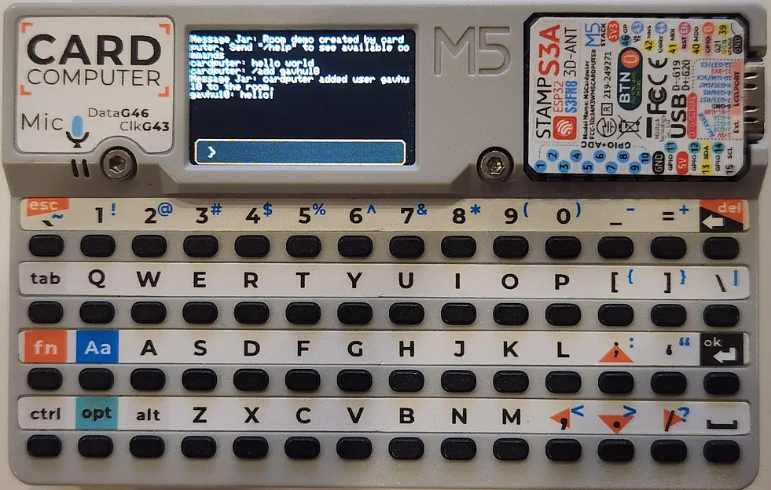

# Message Jar

[Message Jar](https://github.com/gavhu10/MessageJar/) is a messaging platform written in Python with Flask. This is a client for it made for the M5 Cardputer.

*Click image for video*

## Config

Message jar loads its configuration from a file called `mjconfig.json` on the sd card.
If you do not have an valid token saved, Message Jar Cardputer will help you log in or create an account.

## Credits

This code is heavily based off of the excellent [MicroCOM](https://github.com/geo-tp/MicroCOM) project by geo-tp, and started off as a fork of it. Also used in this project is the SdService code from the [Cardputer Game Station Emulators](https://github.com/geo-tp/Cardputer-Game-Station-Emulators/tree/xip_load), which is also made by geo-tp.
